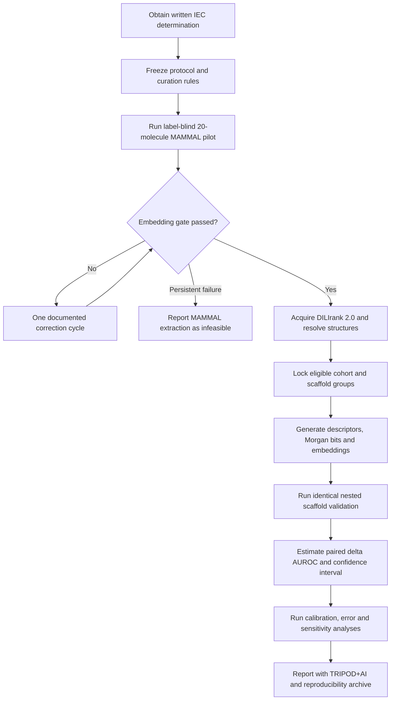

# MAMMAL–DILI Research Project

This repository is the planning and execution home for an undergraduate comparative prediction-model study using DILIrank 2.0.

The study asks one narrow question:

> Among eligible approved small-molecule drugs, does adding a frozen MAMMAL molecular embedding improve prediction of established DILI concern beyond Morgan fingerprints and standard physicochemical descriptors?

This is a drug-level research benchmark. It is **not** a patient-risk calculator, diagnostic device, prescribing tool, causal model, or substitute for toxicology and clinical evidence.

## Current status

**All gates G0-G5 have passed independent validation. The locked primary analysis found that adding the frozen MAMMAL representation reduced AUROC by 0.0804 (95% CI -0.1142 to -0.0420) relative to the conventional comparator. The result applies only to this checkpoint, representation recipe, cohort, learner and validation design; it is not a patient-risk estimate or clinical recommendation.**

Open the completed Next.js research atlas locally with `pnpm dev`, or read the [full report](public/results/research_report.md), [final reporting addendum](public/results/final_reporting_addendum.md), and [G5 independent acceptance](audit/gates/g5-validator.md).

The source drafts contained two competing primary designs. This documentation adopts the later, methodologically stronger design:

- Primary conventional comparator: Morgan fingerprint plus physicochemical descriptors.
- Expanded model: the same conventional features plus a frozen MAMMAL embedding.
- Primary estimand: paired change in AUROC, `AUROC(expanded) - AUROC(conventional)`.
- Primary evaluation: repeated nested, scaffold-grouped cross-validation.
- Dose/logP and the Rule of Two: exploratory analysis in reliably linked oral drugs, not an eligibility condition for the primary study.
- Practical-gain benchmark: `0.03 AUROC`, subject to final confirmation with the biostatistical adviser before outcome analysis.

## Project map

| Document | Purpose |
|---|---|
| [Project charter](docs/00_PROJECT_CHARTER.md) | Purpose, boundaries, stakeholders and success criteria |
| [Plain-language guide](docs/01_PLAIN_LANGUAGE_GUIDE.md) | The entire study without unexplained technical language |
| [Master protocol](docs/02_MASTER_PROTOCOL.md) | Authoritative scientific design |
| [Decision record](docs/03_DECISION_RECORD.md) | Reconciles conflicts among the supplied drafts |
| [Data and curation specification](docs/04_DATA_AND_CURATION_SPEC.md) | Dataset construction, structure resolution and audit rules |
| [MAMMAL feasibility plan](docs/05_MAMMAL_FEASIBILITY_PLAN.md) | Label-blind pilot, embedding contract and go/no-go criteria |
| [Modelling and validation framework](docs/06_MODELLING_AND_VALIDATION.md) | Feature sets, leakage controls and scaffold validation |
| [Statistical analysis plan](docs/07_STATISTICAL_ANALYSIS_PLAN.md) | Estimands, intervals, metrics and interpretation |
| [Limitations and risk register](docs/08_LIMITATIONS_AND_RISKS.md) | Scientific, technical and operational failure modes |
| [Ethics and KUHS pathway](docs/09_ETHICS_AND_KUHS.md) | IEC determination, anonymity, integrity and submission controls |
| [Reproducibility plan](docs/10_REPRODUCIBILITY_AND_DATA_MANAGEMENT.md) | Provenance, versioning, artefacts and change control |
| [Execution roadmap](docs/11_EXECUTION_ROADMAP.md) | Six-month work plan and immediate next actions |
| [Results interpretation guide](docs/12_RESULTS_INTERPRETATION.md) | What each possible result does and does not mean |
| [Deliverables and definition of done](docs/13_DELIVERABLES_AND_DONE.md) | Required outputs and acceptance checks |
| [Glossary](docs/14_GLOSSARY.md) | Clinical, chemical and statistical terms |
| [Protocol-lock checklist](docs/15_PROTOCOL_LOCK_CHECKLIST.md) | Unresolved decisions that must be signed off before analysis |
| [Evidence ledger](docs/16_EVIDENCE_LEDGER.md) | Verified sources, provisional claims and citation notes |
| [Repository blueprint](docs/17_REPOSITORY_BLUEPRINT.md) | Planned code/data layout for the implementation phase |

## End-to-end framework

## Reproduce the study

The implementation now contains strict config schemas, audited cohort construction, exact environment locks, a checkpoint-native MAMMAL extractor, independently hash-bound G2/G3/G4 gates, nested validation, whole-scaffold uncertainty, robustness analyses, report generation, and the Next.js research atlas.

Follow [REPRODUCING.md](REPRODUCING.md). The pipeline intentionally refuses accepted extraction until the two prospective amendments are fully approved and re-locked; it also refuses estimation until an independent reviewer accepts frozen predictions.

